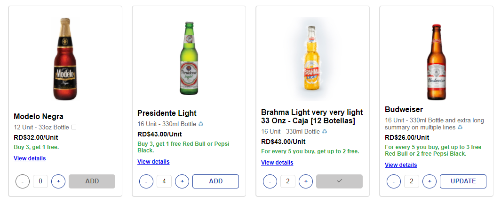
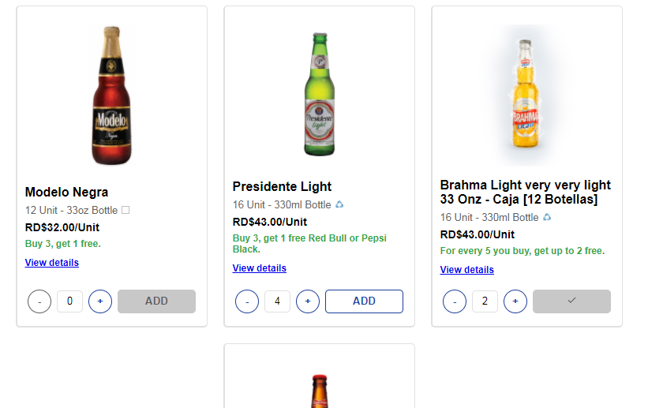
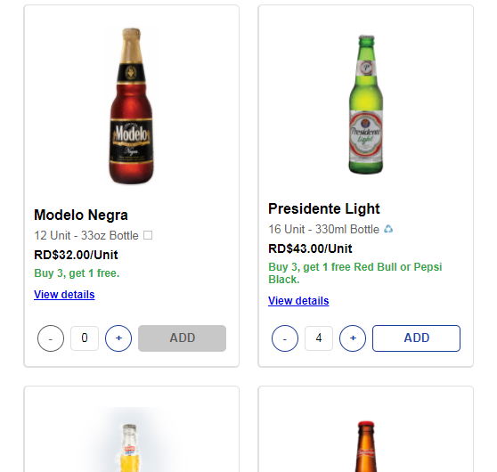
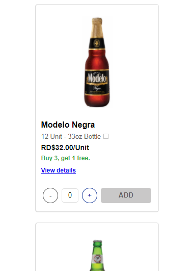

<h3 align="center"> Em Web/Desktop <br />
    
</h3>

<br />

<h3 align="center"> Em Tablet <br />
    
</h3>

<br />

<h3 align="center"> Em tablet pequeno <br />
    
</h3>

<br />

<h3 align="center"> Em Mobile <br />
    
</h3>

<br />


## 🔖 &nbsp; Sobre

Um modelo de exibição de produtos, do que seria uma loja de cervejas.

---
<br />


##  📁 &nbsp; Como baixar o projeto

```bash

    # Clonar o repositório
    $ git clone https://github.com/yangvaz/uz-teste

    # Entrar no diretório
    $ cd uz-teste

    # Instalar as dependências
    $ yarn install

    # Iniciar o projeto
    $ yarn start
```

---

Desenvolvido por Yan Garcia 🥑 
